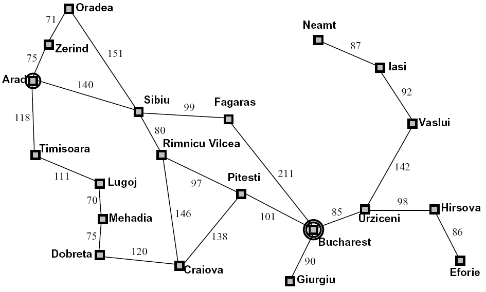

# **Intelligent Agent Artificial Intelligence**

* reference of original video of this slide [here](https://www.youtube.com/watch?v=-Xx0QSFYfIQ) 📌

### **Agents and environments** 📌

* What is agent use in environments? An agent uses sensors to sense its surroundings and then takes action through actuators.

### **Rational:**

Rational agent aims to make choices that bring the best outcomes. Right now, these decision makers have specific goals and try to achieve them with the least effort. 📌

* **Example:**

    - Achieve a goal using the least effort possible (cost).

**Looking Ahead:**

- In the future, decision makers might use **numbers** to measure success.

- They could choose **actions** that bring the most overall success over time.

    - Example: Choosing **actions** that make the most profit in dollars.

### **Specifying the task environment** 📌

| Agent Type   | Performance Measure                                             | Environment                                       | Actuators                              | Sensors                                               |
|--------------|-----------------------------------------------------------------|---------------------------------------------------|----------------------------------------|-------------------------------------------------------|
| **Taxi Driver**  | **Safe, fast**.         | **Roads, traffic**.           | **brake, horn**    | **Cameras, sonar** |

### **Agent design** 📌

* The type of environment significantly shapes how agents are designed:

    - **Fully/Partially Observable:** If the environment is not entirely visible, the agent needs **memory**.
    
    - **Discrete/Continuous:** In continuous environments, agents might not be able to list **all possible states**.
    
    - **Stochastic/Deterministic:** Agents may need to prepare for **uncertainties** in stochastic environments.

    - **Single-Agent/Multi-Agent:** In multi-agent scenarios, agents might need to behave **randomly**.

    - **Episodic vs. Sequential:** Some tasks are episodic (like **chess**), while others are sequential (like a **taxi driver**'s ongoing trip).

    - **Static vs. Dynamic:** Environments can be either static or dynamic, impacting the agent's **decision-making**.

    - **Known vs. Unknown:** law ⚖️ of physics.

### **The structure of agents**

- **AI's Role:** Designing an agent program that implements the agent function, which is essentially the mapping from perception to actions.

- **Agent Definition:** An agent is composed of both architecture and program components. 📌

    * Agent = architecture + program. 📌

### **Agent Program** 📌

- **Simple Reflex Agents**

- **Model-Based Reflex Agents** 

- **Goal-Based Agents** 

- **Utility-Based Agents**

### **Simple Reflex Agents** 📌

* Reflex agents key characteristics include:

    - **Decision Basis**

    - **Memory Option**

    - **Limited Consideration**

    - **World Perspective**

### **Model-based reflex agents**

- **Internal State Dependence:**

    - Agents remember what they've seen before to figure out what's happening now.

- **Simplicity in Braking:**

    - For braking, they don't need a lot of memories. Just the last camera picture helps.

- **Detecting Red Lights:**

    - This setup lets the agent spot when two red lights at the car's edge switch on or off at the same time.

### **Goal-Based Agents:**

- **Beyond Current State:**

    - Knowing the present situation isn't always adequate for deciding actions.

- **Road Junction Scenario:**

    - For instance, at a junction, a taxi can turn left, right, or go straight.

- **Decision Depends on Destination:**

    - The correct choice relies on where the taxi is trying to reach, highlighting the importance of defined goals.

### **Utility-Based Agents:**

- **Beyond Goals:**

    - Goals alone may not ensure optimal behavior in diverse environments.

- **Destination Variation:**

    - For instance, various action sequences can lead the taxi to its destination.

- **Considering Quality:**

    - However, some sequences are quicker, safer, more reliable, or cheaper than others, emphasizing the consideration of utility or quality in decision-making.

### **Learning Agents:**

- **Turing's Approach:**

    - Turing suggests a method for creating learning machines and subsequently instructing them.

### **Planning Agents** 📌

- **Ask "What If"**

- **Decision Hypotheses**
    * Decisions stem from anticipated consequences of actions.

- **Requirement**
    * Need a model of how the world changes with actions.

- **Goal Formulation**

- **Considering Future State**
    * Assess how the world would be.

- **Optimal vs. Complete Planning**

    - Comparison between optimal outcomes and comprehensive planning.

- **Planning vs. Replanning:**

    - Differentiating between initial planning and adapting plans based on changes.

### **Search Problems:**

- **Components:** 📌

  - Involves a state space.

  - Includes a successor function with actions and costs.

  - Specifies a start state and a goal test.

- **Solution Definition:**

  - A solution is a sequence of actions, or a plan, that transforms the start state into a goal state.

### **Well-defined Problems and Solutions:**

- **Components:**

    - Initial state.

    - Actions available to the agent.

    - Transition model: Describes the effect of each action.

    - State space: Defined by the initial state, actions, and transition model.

- **Evaluation:** 📌

    - Goal test: Determines if the agent reaches the goal or not.

    - Path cost: Assigns a numeric cost to each path.

## **Toy Problem: Vacuum World**

- **States:**
    - Both agent location and dirt location (2 locations).

- **Possible States:**
    - 2 * 2^2 = 8 possible states (n * 2^n).

- **Initial State:**
    - Any state can be designated as the initial state.

- **Actions:**
    - Three actions: left, right, and suck.

- **Transition Model:**
    - Actions have expected effects on the state.

- **Goal Test:**
    - Checks whether all squares are clean.

- **Path Cost:**
    - Each step incurs a cost of 1.

### **Example: Traveling in Romania** 📌

**Note: they may take you example like this ask for state space and success function and start state and goal test**

* State space:
    * Cities

* Successor function:
    * Roads: Go to adjacent city with ( cost = distance )

* Start state:
    * Arad

* Goal test:
    * Is state == Bucharest?

### **Measuring Problem-Solving Performance:** 📌

- **Completeness:**
    - Is the algorithm guaranteed to find a solution when one exists?

- **Optimality:**
    - Does the strategy find the optimal solution?

- **Time Complexity:**
    - How long does it take to find a solution?

- **Space Complexity:**
    - How much memory is needed to perform the search?

### **State Space Graphs:**

**Definition:** A mathematical representation of a search problem.

- **Node Representation:**
    - Nodes represent abstracted world configurations.

- **Arcs:**
    - Arrows represent successors, or the results of actions.

- **Goal Test:**
    - The goal test involves a set of goal nodes, possibly just one.

- **Uniqueness:**
    - Each state occurs only once in the state space graph.

- **Memory Constraint:**
    - While it's impractical to construct the entire graph in memory due to its size, the concept is valuable for problem-solving.

### **Search Tree:**

**Definition:** A "what if" tree illustrating plans and their outcomes.

- **Root Node:**
  - The start state serves as the root node.

- **Children:**
  - Correspond to successors or possible actions.

- **Node Representation:**
  - Nodes depict states but correspond to plans that achieve those states.

- **Practical Limitation:**
  - For many problems, constructing the entire tree in memory is often impractical.

### **State Space Graphs vs. Search Trees** 📌

**Note: just know what is search tree and state space graph look like for searching in the picture.**

- **Efficient Construction of Search Tree:**

  - Each step in the search tree represents a complete journey in the world of possibilities.
  
  - We only build what we need, and we try to use as little effort as possible.

### **Searching with a Search Tree**

- **Simple Explanation of Search:**

  - **Exploring Ideas:**
    - Check different ways we can solve a problem, like looking at different plans.

  - **Keeping Options:**
    - Keep track of the ways we are considering but haven't decided on yet.

  - **Efficiency Goal:**
    - Try to figure things out by looking at as few options as possible.

### **General Tree Search:** 

- **Key Concepts:**
  - Fringe
  - Expansion
  - Exploration strategy
  
- **Central Question:** Deciding which fringe nodes to explore is the main focus?

### **Example: Tree Search** 📌

s ( good step 1 )
s->d ( good step 2 )
s->e
s->p
s->d->b
s->d->c
s->d->e ( good step 3 )
s->d->e->h
s->d->e->r ( good step 4 )
s->d->e->r->f ( good step 5 )
s->d->e->r->f->c
s->d->e->r->f->G ( good step 6 )

* **Search Tree**

* **State Space Graph**

